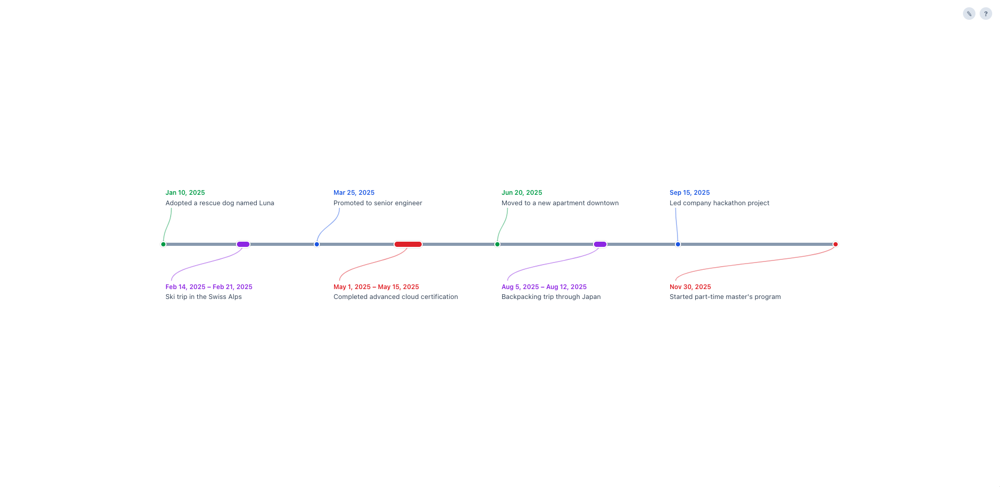
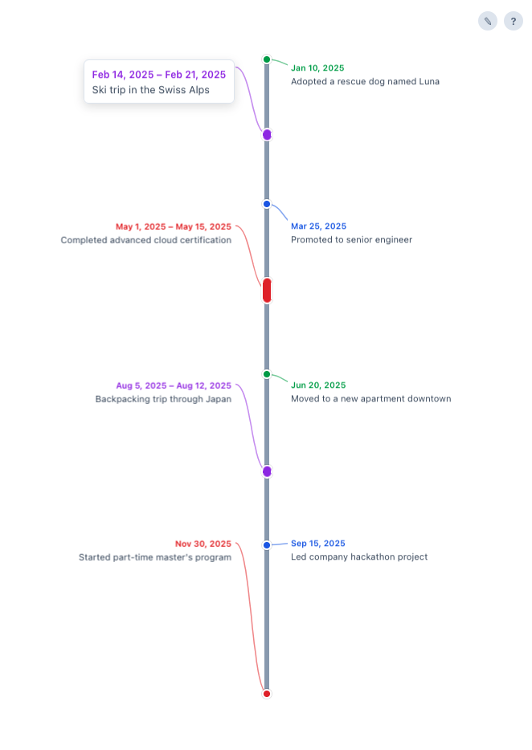

# Timeline App

A single-page timeline visualization built with React and TypeScript. Events are defined in a simple markdown file, parsed at runtime, and rendered as a proportionally-positioned horizontal timeline with color-coded categories.

### Desktop



### Mobile

<p align="center">
  
</p>

## Features

- **Proportional date positioning** — events are placed along the axis based on actual date gaps
- **Single-day and multi-day events** — dots for single dates, ellipse bars for date ranges
- **Automatic color coding** — event types are assigned colors from a built-in palette
- **Alternating labels** — events alternate above/below the axis with SVG connector lines
- **Hover tooltips** — full event details shown on hover
- **Responsive layout** — horizontal on desktop, rotated to vertical on mobile
- **In-browser editor** — edit the event data directly via a built-in text editor

## Getting Started

### Prerequisites

- Node.js 18+

### Install and Run

```bash
npm install
npm run dev
```

The app will be available at `http://localhost:5173`.

### Build for Production

```bash
npm run build
npm run preview
```

## Event Data Format

Events are defined in `public/events.md`. Each line follows one of two formats:

**Single-day event:**
```
YYYY-MM-DD [type] Description text
```

**Multi-day event:**
```
YYYY-MM-DD to YYYY-MM-DD [type] Description text
```

Example:
```
2025-01-10 [personal] Adopted a rescue dog named Luna
2025-02-14 to 2025-02-21 [travel] Ski trip in the Swiss Alps
2025-03-25 [career] Promoted to senior engineer
```

Type tags are freeform strings in brackets (e.g. `[career]`, `[travel]`, `[personal]`). The parser ignores blank lines and headings.

## Tech Stack

- React 18
- TypeScript 5.6
- Vite 5.4
